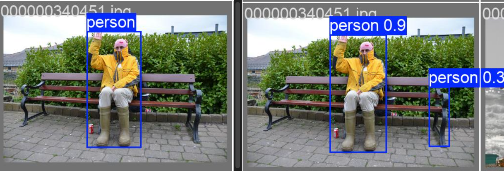
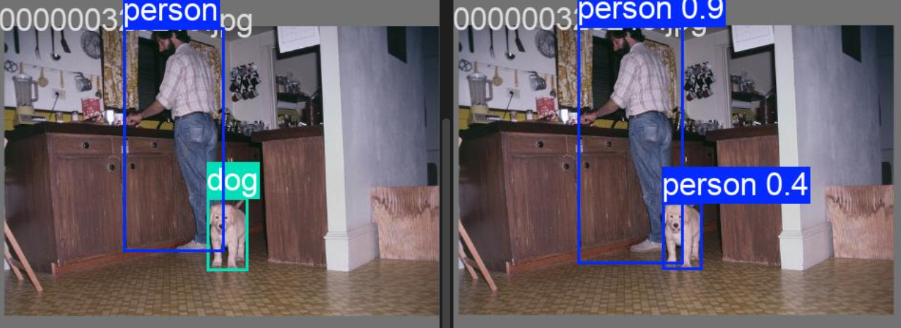
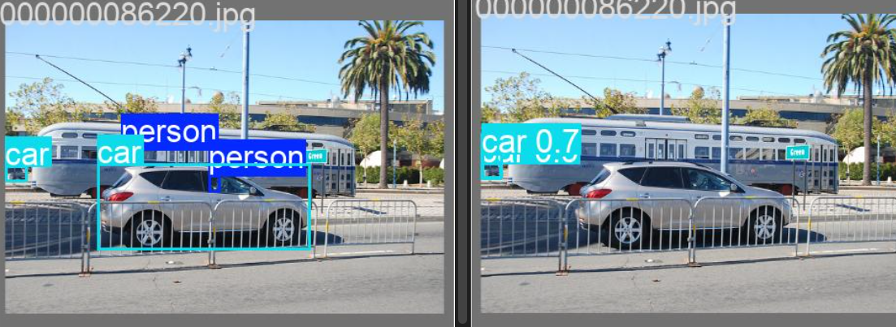
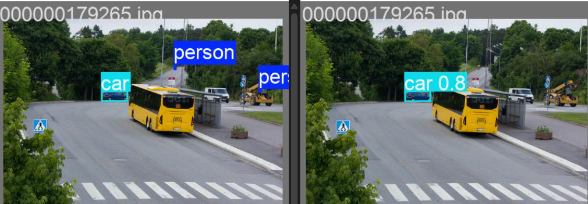

"""

# 🔍 Object Detection Case Study: Mini-COCO Analysis & Deployment

Bu proje, COCO 2017 veri setinden türetilmiş 5 kategorilik (person, car, dog, cat, chair) özel bir veri seti üzerinde YOLOv8 mimarisi kullanılarak gerçekleştirilen bir nesne tespit çalışmasıdır. Çalışma; veri ön işleme, transfer learning tabanlı fine-tuning, detaylı metrik analizi ve kullanıcı odaklı bir çıkarım (inference) arayüzü sunmaktadır.

---

## 🏗️ Proje Mimarisi ve Model Seçimi

- **Model:** YOLOv8n (Nano)
- **Strateji:** Transfer Learning & Fine-Tuning

Neden YOLOv8n?

- Hız/Doğruluk Dengesi: 3.2M parametre ile düşük donanımlarda bile yüksek FPS sunması.
- Subset Uyumu: Kısıtlı veri setinde (300 görüntü) aşırı öğrenme (overfitting) riskini minimize etmesi.
- Inference: Streamlit üzerinde düşük gecikmeli (low-latency) analiz imkanı.

---

## 🛠️ Veri Hazırlama Süreci (Data Pipeline)

- **Format Dönüşümü:** COCO formatındaki `instances.json` dosyası, YOLO'nun beklediği `.txt` formatına dönüştürülmüştür.
- **Normalizasyon:** Bounding box koordinatları [0, 1] aralığına normalize edilmiştir.
- **Kategori Mapping:** 5 kategori özel ID mapping ile yeniden indekslenmiştir: `{1: person, 3: car, 17: cat, 18: dog, 62: chair}`
- **Veri Bölümleme:** Veri seti %80 Eğitim / %20 Doğrulama (Val) olarak `random_state=42` ile ayrılmıştır.

---

## 📊 Performans Analizi (Metrikler)

Modelin başarısı, mAP@0.5, Precision, Recall ve F1-Score metrikleri üzerinden değerlendirilmiştir.

### 1. Genel Performans

Eğitim 50 epoch boyunca sürdürülmüş ve modelin "öğrenme kapasitesi" mAP@0.5 skorunun 0.11'den 0.49'a çıkmasıyla kanıtlanmıştır.

### 2. Kategori Bazlı Performans Tablosu

Aşağıdaki tablo, her bir nesne sınıfı için modelin özelleşmiş başarısını göstermektedir:

| Kategori | Images | Instances | Precision | Recall | mAP@0.5 | F1-Score |
| -------: | :----: | :-------: | :-------: | :----: | :-----: | :------: |
|      All |   60   |    223    |   0.636   | 0.403  |  0.492  |   0.49   |
|   Person |   48   |    151    |   0.758   | 0.497  |  0.614  |   0.60   |
|      Car |   11   |    51     |   0.609   | 0.451  |  0.461  |   0.52   |
|      Cat |   3    |     3     |   0.947   | 0.667  |  0.913  |   0.78   |
|      Dog |   4    |     4     |   0.382   | 0.250  |  0.254  |   0.30   |
|    Chair |   7    |    14     |   0.328   | 0.214  |  0.215  |   0.26   |

**Analitik Yorum:**

- Person Bias: "Person" sınıfının veri setindeki baskınlığı, modelde bir yanlılığa (bias) yol açmış; bu da nadir sınıflarda (dog, chair) recall değerlerinin düşük kalmasına neden olmuştur.
- İstatistiki Güven: "Cat" sınıfındaki 0.91 mAP değeri, örnek sayısının azlığı nedeniyle bir genelleme başarısı olarak değil, modelin o spesifik örneklere adaptasyonu olarak okunmalıdır.

---

## 🧐 Hata Analizi (Error Analysis)

Modelin başarısız olduğu noktalar, sistemin geliştirilmeye açık yönlerini (limitasyonlarını) anlamak adına analiz edilmiştir.

### 1. Başarısız Tahmin Örnekleri ve Teknik Nedenleri

- **Örnek 1:** False Positive (Yanlış Pozitif) - Bank/İnsan Karışıklığı  
    
  **Gözlem:** Bankın dikey hatları "Person" olarak etiketlenmiştir.  
  **Analiz:** Model, dikey ve ince formları eğitim setindeki insan silüeti şablonuyla karıştırmıştır. Doku benzerliği, modelin arka plan gürültüsünü nesne olarak yorumlamasına neden olmuştur.

- **Örnek 2:** Misclassification (Yanlış Sınıflandırma) - Köpek/İnsan Yanlılığı  
    
  **Gözlem:** Köpek nesnesi "Person" olarak sınıflandırılmıştır.  
  **Analiz:** Veri setindeki sınıf dengesizliği nedeniyle modelde "Person Bias" oluşmuştur. Model, ayırt edici özniteliklerin zayıf olduğu durumlarda en çok gördüğü sınıfa yönelmektedir.

- **Örnek 3:** False Negative (Yanlış Negatif) - Kaçırılan Gri Araba  
    
  **Gözlem:** Belirgin olmasına rağmen gri araba tespit edilememiştir.  
  **Analiz:** Arka planla düşük kontrast ve nesne sınırlarının gürültü içinde kaybolması, modelin güven skorunun eşik değerin altında kalmasına yol açmıştır.

### 2. Küçük Nesne Analizi (<32x32 px)

  
Modelin Recall oranının (0.40) düşük olmasının temel sebebi, veri setindeki küçük nesnelerin tespit edilememesidir. YOLO mimarisi görüntüyü gridlere böler; 32x32 piksel altındaki nesneler, öznitelik haritası üzerinde yeterli sinyal üretemediği için "arka plan" olarak sınıflandırılmaktadır.

---

## 💻 Streamlit Dashboard Özellikleri

Geliştirilen arayüz, modelin pratik kullanımını simüle eder:

- Görüntü Yükleme: Sürükle-bırak (drag & drop) desteği.
- Dinamik Threshold: Kullanıcının hassasiyet ayarı yapabilmesi için gerçek zamanlı Confidence Slider.
- Görselleştirme: Tahminlerin bounding box ve güven skoru ile gösterimi.
- Metrik Raporlama: Tespit edilen toplam nesne sayısı ve sınıf bazlı dağılım.

---

## 🚀 Kurulum ve Çalıştırma

1. Gereksinimlerin Yüklenmesi:

```bash
pip install -r requirements.txt
```

2. Uygulamanın Başlatılması:

```bash
streamlit run app.py
```

---

## 📂 Proje Yapısı

- `prepare_data.py`: COCO JSON -> YOLO TXT dönüşüm scripti.
- `train.py`: Model eğitim ve fine-tuning süreci.
- `app.py`: Streamlit dashboard uygulaması.
- `data.yaml`: Veri seti yapılandırma dosyası.
- `weights/best.pt`: Eğitilmiş model ağırlıkları.
- `results.csv`: Eğitim süreci metrik kayıtları.
- `assets/`: Hata analizi görselleri.
